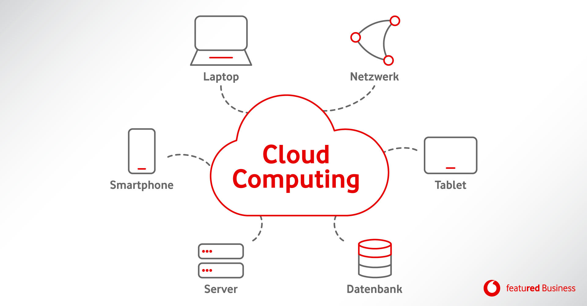
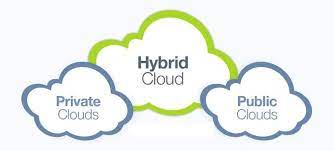
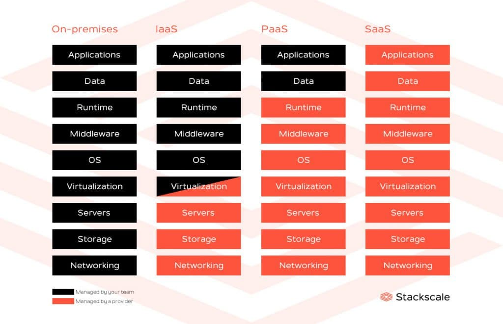

# M431 Dokuemtation Cloud 

# Einführung:
In dieser Dokumentation, möchte ich euch gerne die Cloud etwas näher bringen. 
Wenn euch das lesen zu langweilig findet, könnt ihr euch das Lernvideo anschauen: 

# Was ist eine Cloud:  
Stellt euch vor, Ihr sitzt in eurem Zimmer und arbeitet an eurem PC. 
Auf einmal, schlägt ein Blitz direkt bei euch ein und eure Geräte gehen kaptutt. 
Anstaht, nun zu eurem Lehrer zugehen und Ihm die Geschichte zu erklähren. "Kein Backup KEIN MITLEID!!"
Steht Ihr auf und grinst und wisst, meine Daten sind sicher in der Cloud. 

Wenn nun etwas in der Cloud gespeichert wird, heisst das so viel wie es wird auf einem Internetserver gespeichert, anstaht auf dem PC. 
Ganz simpel gesagt, es funktioniert so ählich wie eine externe SSD / HDD, wenn du mit dem Internet verbunden bist.  

# Die Typen einer Cloud: 

In Cloud Computing gibt es zwei unterschiedliche Themen: 
"Deployment Model" und "Service Model"

## Deployment Model   
Deployment Model ist wiederum in drei Teile unterteilt. 

    - Public Cloud 
    - Privat Cloud 
    - Hybrid Cloud 

 
## Public Cloud: 
Bei der Public Cloud handelt es sich um einen Cloudmodel, wo Computerdienste über das Internet von verschiedenen Kunden genutzt werden. 
Die Service werden von dem Kunden nicht vor Ort geostet. 
Unternehmen, speicher hier gerne Ihre nicht so sensyblen Daten. 

## Private Cloud:   
Dies ist ein Cloud-Model, bei dem die Infrastruktur nur einem Unternehmen zugewiesen ist. Das heisst, nur das Unternehmen hat darauf zugriff, Externe Benutzer nicht! 
In der Regel, sind die Unternehmen selber verantwortlich, dass System in Schuss zuhalten. 

Für eine Private Cloud, benötigt man einiges and IT-Know how. Im Gegensatzt erhält man mehr Kontrolle und Sicherheit als bei den anderen Modellen.  

## Hybride Cloud: 
Dieses Cloudmodel ist eine kombination aus Public und Private. 
Der grosse Vorteil dieses Model ist, man kann die Daten problemlos zwischen Private und Public hin und her schieben.  

# Service Model
Service Model ist auch wieder unterteilt in drei Teile:      
    
    IAAS 
    PAAS
    SAAS

## IAAS 

    - Steht für "Infrastrucktur as a Service"
    - Hier bekommen die User Zutritt zu "Basic Computer Infrastruktur"
    - Dies wird in den meisten Fällen von IT-Administratoren benutzt
    - BEi IAAS muss Ihr euch nur um Applicationen, Data, Runtime, Middleware und o/s kümmern 
    - Den Rest übernimmt dier Cloudproieder

## PAAS
    - Steht für "Plattform as a Service"
    - Brauchbar für Defeloping, Testing und Manage von Aplikationen
    - Dies erläubt den User, die Applikationen zu entwikel, ohne die Cloud zu Managen / Maintainen
    - Sie müssen sich nur um Applicationen und Data kümmern 

## SAAS
    - Steht für "Software as a Servie"
    - Dies beinhaltet: Hosting und Managing Appliaktionen 
    - Für Unternehmen, die nicht wirklich IT-Geräte benötigen
    - Hier wird alles gestellt von dem Cloud-Unternehmen 

Hier findet Ihr eine Link zur Dokumentation Chatbot und Video: 

