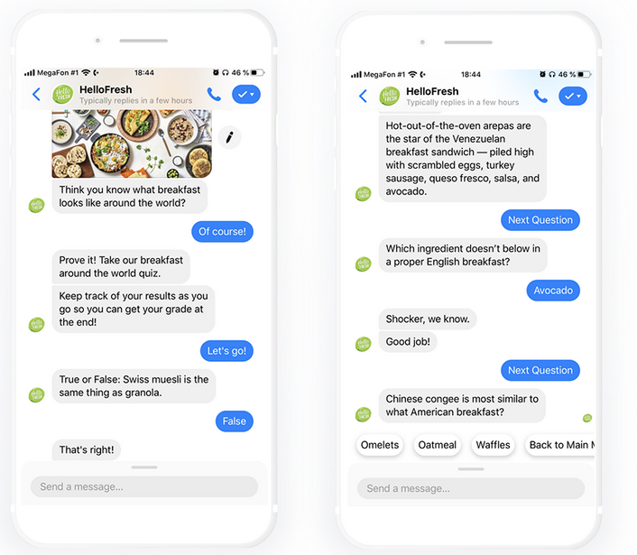
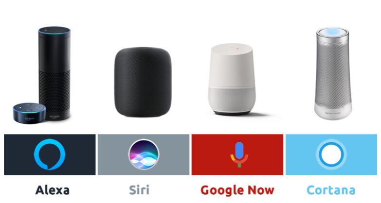

# Dokumentation Chatbot 

## Um was geht's? 
In diesem Modul möchte ich gerne ein Chatbot auf AWS entwickeln und ein Lernvideo erstellen, um mein Wissen weiter zu geben. 

---

## Was ist ein Chatbot?
Der Ursprung eines Chatbots liegt in der Vision von Alan Turing und führt auf intelligente Maschinen in den 1950er Jahren zurück. Seitdem hat sich die künstliche Intelligenz (Grundlage eines Chatbots) immer weiterentwickelt. 

Simpel erklärt ist ein Chatbot ein Computerprogramm, welches menschliche Konversationen verarbeitet und simuliert. So könnnen Menschen mit den Maschinen interagieren und kommunizieren. 
So ein Bot kann je nach Entwicklung einfache Kommunikationen führen oder als digitaler AssistentIN dienen. 
Es gibt aber auch Bots, die Systeme checken und einen Alarm senden, wenn dieses System ausfällt. 

Beispiel eines Bots
 

----

## Wie funktioniert das? 
Die meisten Chatbots funktionieren auf KI (Künstliche Intelligenz), automatisierten Regeln, Natural-Language Processing und maschinelles Lernen, sie verarbeiten Daten und antworten auf Anfragen aller Art. 

# Es gibt zwei Typen: 

## Aufgabenorientierte (deklarative) Chatbots
    
Dies sind Einzweckprogramme, welche sich auf die Ausführung einer Funktion konzentrieren. Mit Regeln und Natural-Language Processing erzeugen sie automatisierte Antworten auf Kundenanfragen. Diese Art von Chatbots eignen sich vor allem für Support- und Serviceanfragen. Sie können häufig gestellte Fragen beantworten, welche keine Vielzahl von Variablen beinhalten.  

---

## Datengesteuerte und prädiktive (gesprächsorientierte) Chatbots

Sie werden gerne als digitale beziehungsweise virtuelle Assistenen bezeichnet. Sie sind viel anspruchsvoller, interaktiver und personalisierter als aufgabenorientierte Chatbots. 
Die Bots sind kontextbezogen und nutzen das natürliche Sprachverständnis, um zu lernen. Hierbei werden künstliche Inelligenz und Analysen eingesetzt, um eine Bindung zu schaffen. 
Bekannte Chatbots: 
        
    - Siri  (Apple)
    - Alexa (Amazon)

Bilder der Bots: 
   

----

## Wo wird's verwendet? 
Chatbots werden heute häufig verwendet, um die IT-Service-Erfahrung zu verbessern, welche sich mit Self-Service und der Automatisierung von Prozessen befasst. 

Chatbots werden in den Unternehmen im Support-Bereich eingesetzt. Sie können viel schneller Anfragen entgegennehmen und lösen als menschliches Personal. Mit einem Bot kann man nun rund um die Uhr Aufgaben wie Passwortaktualisierungen -änderung erfassen oder Systemstatus überwachen und diese dokumentieren.    
Leider können sie momentan noch nicht alle Probleme lösen und werden deshalb gerne als erster Ansprechpartner verwendet.
Ein Chatbot in diesem Bereich soll die Menschen unterstützen und nicht ersetzen. 

Sie werden auch gerne zur Einweisung neuer Mitarbeiter verwendet. 
Man kenn das doch, man öffnet zum ersten Mal ein neues Programm und dires wird eine Art Rundtour angeboten. So ähnlich funktioniert dies auch bei einem Eintritt. 

