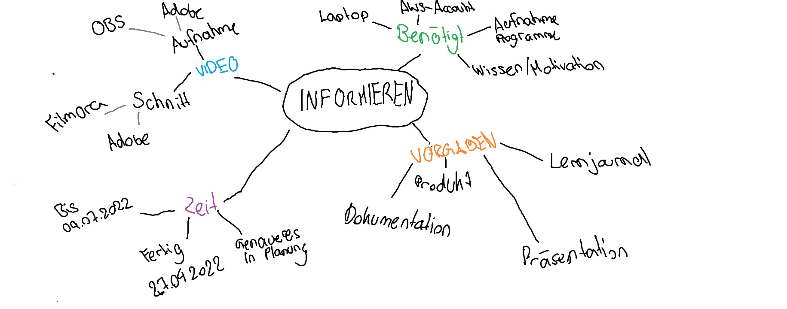

# Informieren: 
Als erstes habe ich mir Projektideen ausgedacht und diese in ein Paint-Mindmap aufgeschrieben. 
Nachdem die Kanditaten feststanden, habe ich mich an die Arbeit gemacht und Informationen gesucht. Die grundlegenden Informationen habe ich ins Mindmap geschrieben.  

Die Informationen zu Cloud, Chatbot und Video findet ihr im Ornder Dokumentationen. 

Hier findet Ihr einen Link zu Planen: 

