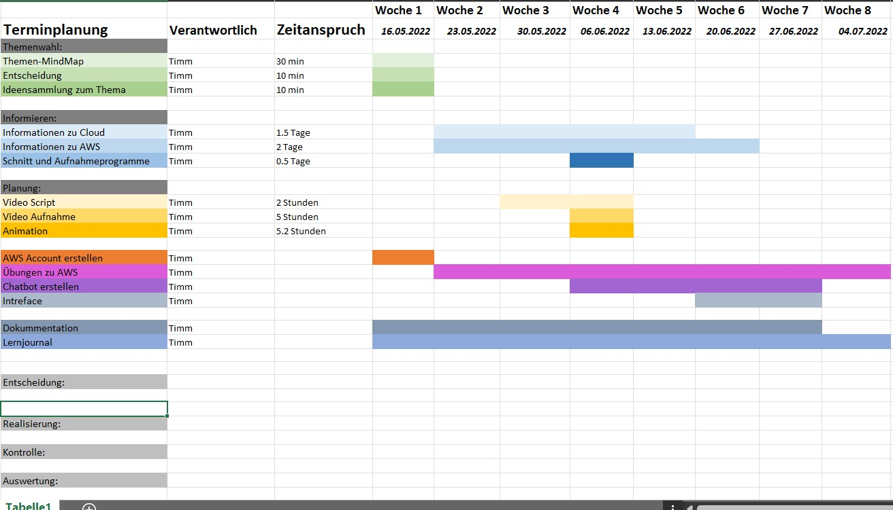

# Planung 
Damit man beim Umsetzen eines Projektes nicht in Stress gerät und sich die Zeit der Abgabe verschiebt, ist es sehr wichtig, dass man sich einen Zeitplan erstellt. 

----

## Mein Plan 
Die Planung habe ich nach der Entscheidung begonnen, da ich glaube, dies ist die bessere Herangehensweise.

In meiner Planung habe ich beschlossen, alles zu strukturieren in Informieren, Planung und co.
Dies habe ich gemacht, um alles auf den ersten Blick zu sehen. Dafür habe ich auch Farben verwendet. Zudem habe ich geplant, eine Woche vor der offiziellen Abgabe fertig zu werden, um eine Woche als Puffer zu haben.  

Das Projekt habe ich mit der "GANT" Methode umgesetzt: 

----

## Analyse der Woche: 

    - Diese Woche habe ich nach dem zeitlichen Ziel abgeschlossen. 
    
    - Die Woche 2 konnte ich auch noch zeitlich korrekt abschliessen. 
    
    - Woche 3 ging zeitlich auch noch sehr gut. Informationen wurden gesammelt und die Videoideen wurden aufgeschrieben. 
    
    - In Woche 4 wollte ich ein Video erstellt haben, dies habe ich leider nicht erreicht. 
    
    - Mit einer Woche Verspätung habe ich das Video aufgenommen und geschnitten. 
    
    - In Woche 6 war geplant, dass ich den ersten Chatbot erstellt habe, dies lief leider nicht nach Plan und wurde erst am Freitag diese Woche erstellt. 
    
    - In Woche 7 muss ich meinen Hintern in die Höhe bewegen und mich anstrengen, um alles fertig zu bekommen. 

Hier findet Ihr einen Link zu Entscheiden:
    

