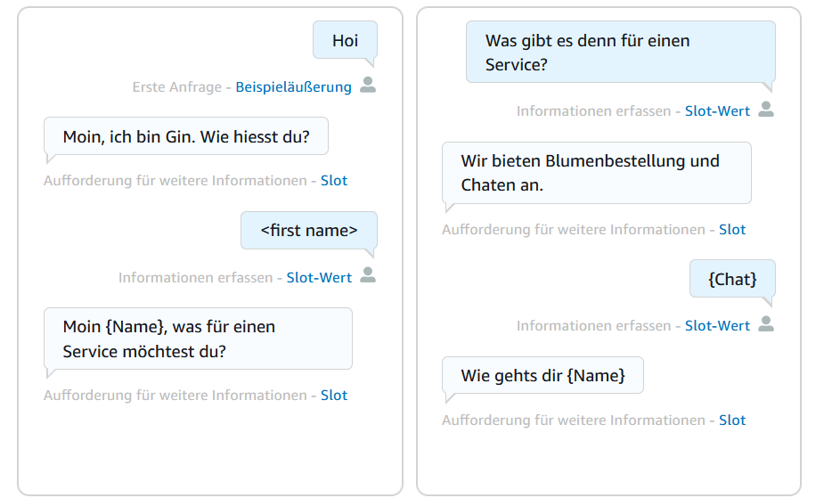
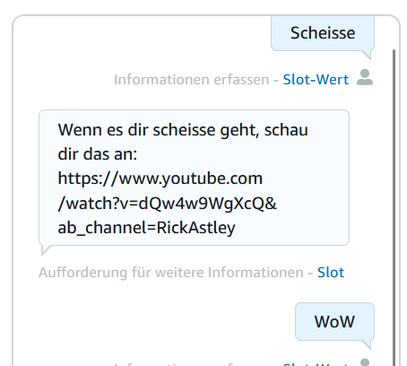
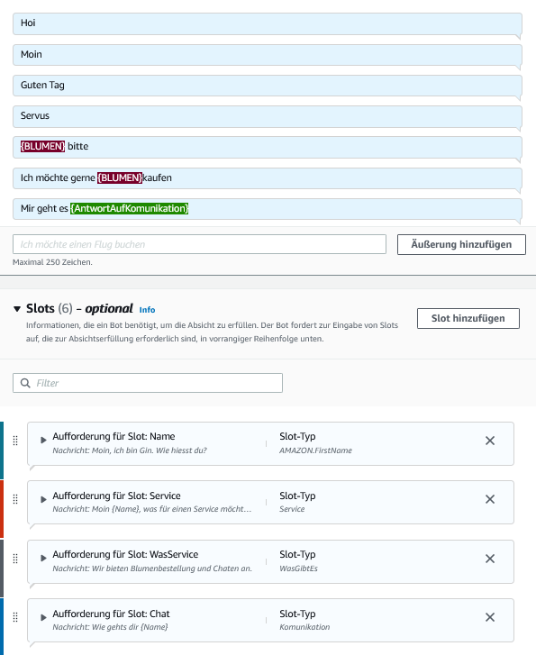

# Realisieren
Im Realisieren geht es um die Erarbeitung des Projektes. 
Das heisst, hier muss man den Zeitplan im Auge behalten und die Ziele erreichen, die man sich gesetzt hat. Auch wenn man seinen Hintern bewegen muss :). 

## Step 1: 
Nach dem Informieren, Planen und Entscheiden beginnt die Realisierung des Projektes. 
Hierbei habe ich mich entschieden einen Chatbot auf AWS zu erstellen. 
Wichtig ist zum Start: 

    - Grundwissen zur Cloud             = Erledigt
    - Grundwissen zu einem Chatbot      = Muss noch vertieft werden
    - AWS-Account                       = Erledigt
 

Der erste Step ist nun abgeschlossen. Nun geht es weiter zu 

## Step 2: 
Im zweiten Step wird ein Chatbot erstellt.
Ich mache meinen Chatbot mit Amazon Lex, dies ist ein Amazon Service, welcher die Stimme und Text verwendet. Vom Aufbau ähnelt es dem Amazon Produkt Alexa.

Amazon Lex kann man ganz einfach in der Konsole herunterladen. Hierfür scheibet man in der Suchleiste nur Amazon Lex und läd dies herunter. 
(Bild einfügen)

Nachdem ich nun Lex heruntergeladen habe, habe ich mir ein paar Videos angeschaut. Hier habe ich mir Insperationen geholt, was ich erstellen möchte. 
Leider waren manche Filme nicht so spannend und es gab da auf YT so coole Thumbnails und zack war schon abend :(. 
Allerdings habe ich am Tag drauf den ersten Bot erstellt. 

Der erste Bot, sollte Pizza bestellungen entgegennehmen. Dies habe ich in der Lex Console erstellt und gespeichert. 
Am Ende muss man den Bot erstellen und testen. Während diesem Schritt ist eine Meldung aufgetreten, welche gemeldet hat, dass Englisch nicht unterschtützt wird. Darauf hin habe ich die Sprache gelöscht und sehr warscheinlich auch den Bot. Dumm gelaufen. Bis ich das aber gemerkt habe ist eine kleine Zeit vergangen. 

Bei dem zweiten Bot handelt es sich um einen Blumenbestellungsbot. Dieser sollte die Kunden begrüssen und diese bitten Ihre Bestellung abzugeben. Zudem fragt er den Kunden nach dessen Wohnort, Adresse, E-Mail und Namen umd die Bestellung aufzunehmen. Wenn alle Abfragen erfolgt sind, bendet er die Bestellung mit der Frage: Kann ich diese Bestellung bearbeiten? 
(Bild einfügen)

Wenn der Kunde nun mit YES antwortet wird diese Bearbeitet, antwortet der Kunde mit NO wird die Bestellung abgebrochen. 

Das Erstellen des Bots hat einwandfrei funktioniert und funktioniert auch, allerdings möchte ich Ihn gerne noch etwas überarbeiten und in eine Webseite oder Discord einbinden, damit es etwas schöner aussieht. 

Als dritten Bot möchte ich gende einen erstellen, welcher mit den Kunden komuniziert und Ihnen fragen stellt und anders rum. 
Dies wird sicher etwas schwieriger aber ich denke mit der gewissen Motivation machbar. 

## Step 3: 
Als vierten und Finalen Chatbot wollte ich einen Service-Bot erstellen. Dieser Bot sollte entweder eine Anfrage zur Blumenbestellung entgegen nehmen oder einfach mit dem Kunden komunizieren und Ihn gegebenfalls aufheitern. 

Dies sind Bilder wie der Chat aufgebaut ist

-------

Hier führ muss nun ein neues Projekt erstellt werden, welches den Namen ServiceBot erhalten hat. 
Als erstes wurden die allgemeinen Informationen ausgefüllt, Begrüssung, Wie heisst die Person? usw. 
Als zweiter Schritt wurden die einzelnen Slots erstellt und mit leben befüllt. Wie zum beispiel der Bestellungsbot. 
Im Anschluss, wird getestet und fehler behoben. 
Dann wurde sich an die Verknüpfung gewagt. Das ziehl war ja, eine Auswahl zu geben wo der Kunde drauf Antworten muss. Allerdings wollte es dann nicht zu dem jeweilgen Abteil switchen. Auch wenn es führ mich logisch danach aussah. Auch ein Switchen zu einer anderen Abseicht habe ich leider nicht hinbekommen. Wenn ich das geschafft hätte, währe die Übersicht viel geiler gewesen. Hat aber wie gesagt leider nicht funktioniert. 
An diesem Problem habe ich mit den ganzen Sonntag die Zähne ausgebissen und habe leider nicht wirklich was hinbekommen. Am Ende habe ich noch etwas endekt, wie man mit den {} auf ein Slot verweisen kann. Komischer Weise hat das aber nicht funktioniert. Computers halt :)

Hier findest du ein Bild der Slots:

------

## Probleme: 
Beim erstellen des finalen Bots, kamm es immer wieder zu fehler, da etwas nicht existiert oder zu dem gewünschten Slot / Abteil nicht switchen möchte. 

Ein grosses Problem, waren auf jednfall die Fehlermeldungen. Diese konnte ich ma Anfang noch nicht verstehen und daher wusste ich nicht was der Fehler ist. Richtung Ende habe ich diese dann lagsam verstanden. 

Ein grosses Problem, welches mir sehr gestört hat, war die nicht vorhandene Möglichkeit die Abteile zu Switches. Dies hätte mir geholfen, die Übersicht zubehalten. Da dies nun nicht funktioniert hat, muss ich die Slots mit den Befehlen abrufen. 
Problem, es wird immer unübersichtlicher. Ich habe die Slots erstellt und die Verbindung hinzugefügt. Nach meiner Logic sollte dies nun Funktionieren. Dies war leider nicht der Fall. An diesem Problem habe ich fast den ganzen Sonntag gehangen und keine Lösung gefunden.   

## Wurde die Ziele eingehalten? 
Ansich bin ich sehr glücklich über mein Projekt. Ich habe doch einiges über Cloud gelernt, wo ich zuvor noch nichts wusste. 
Auch die Abeit hat mit sehr viel Spass gemacht und war zu keiner Zeit langweilig, na gut es gab da eins zwei Momente wo die Motivation nicht ganz da war. Aber das gibt es immer. 

Ich habe bestimmte Termine, die ich mir gestellt habe nicht ganz eingehalten. Wie zum Beispiel die Produktion des Videos wurde eine Woche später fertigt oder der Chabot welcher eine Woche später fertig wurde und immer noch nicht ganz so funktioniet aber ansich bin ich sehr zufrieden. 

## Teilerfolge? 
Die gab es auf jeden fall. 
- Die Erstellung des ersten Bots ohne hilfe eines Videos wo der Bot auch funktionierte. 
- Das Wissen, welches ich mir aufgebaut habe. 
- Der Spass

Hier findet Ihr einen Link zur Kontrolle 
 