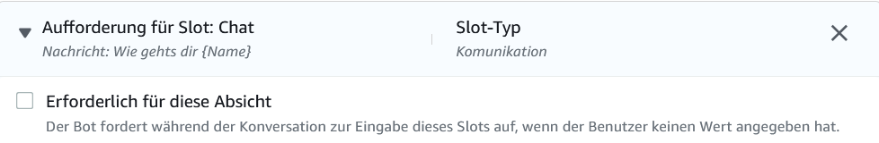
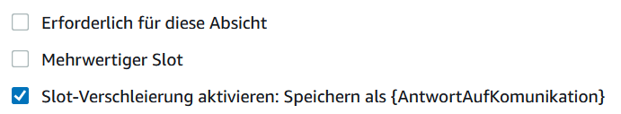
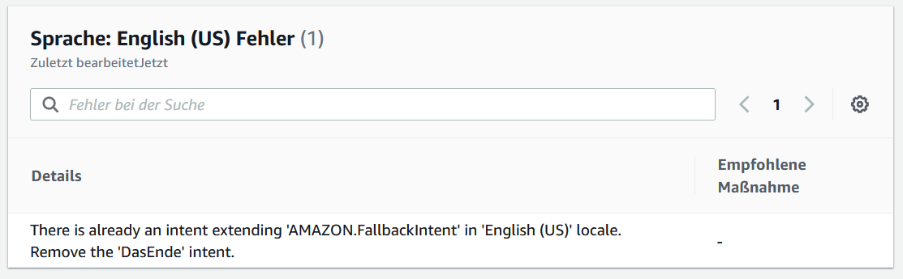
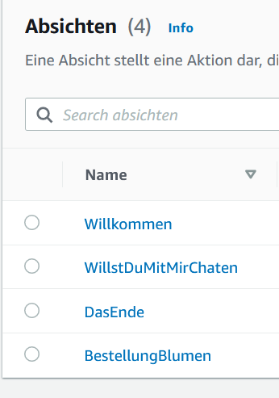
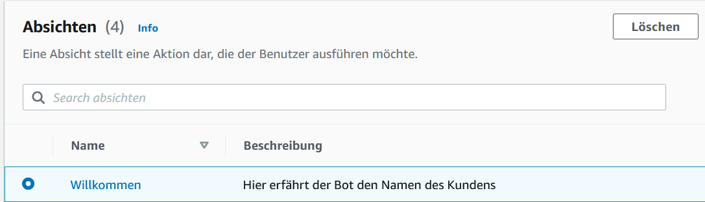
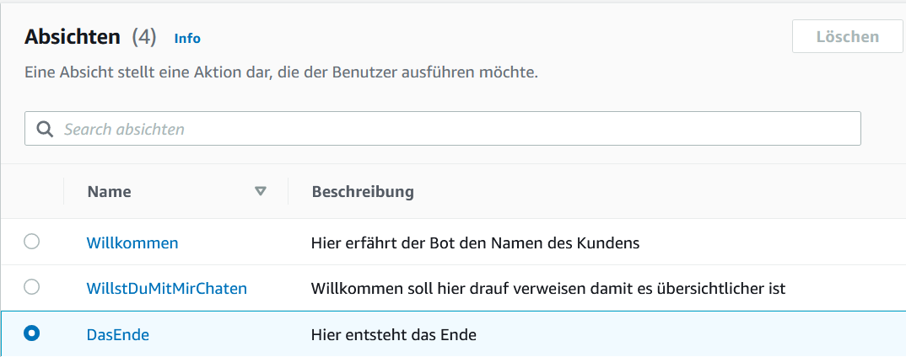

# Realisieren
Im Realisieren geht es um die Erarbeitung des Projektes. 
Das heisst, hier muss man den Zeitplan im Auge behalten und die Ziele erreichen, die man sich gesetzt hat. Auch wenn man seinen Hintern bewegen muss :). 

----

## Step 1: 
Nach dem Informieren, Planen und Entscheiden beginnt die Realisierung des Projektes. 
Hierbei habe ich mich entschieden, einen Chatbot auf AWS zu erstellen. 
Wichtig ist zum Start: 

    - Grundwissen zur Cloud             = Erledigt
    - Grundwissen zu einem Chatbot      = Muss noch vertieft werden
    - AWS-Account                       = Erledigt
 

Der erste Step ist nun abgeschlossen. Nun geht es weiter zu 

----

## Step 2: 
Im zweiten Step wird ein Chatbot erstellt.
Ich mache meinen Chatbot mit Amazon Lex. Dies ist ein Amazon Service, welcher die Stimme und Text verwendet. Vom Aufbau ähnelt es dem Amazon Produkt Alexa.

Amazon Lex kann man ganz einfach in der Konsole herunterladen. Hierfür schreibt man in der Suchleiste nur Amazon Lex und lädt dies herunter. 
(Bild einfügen)

Nachdem ich nun Lex heruntergeladen habe, habe ich mir ein paar Videos angeschaut. Hier habe ich mir Insperationen geholt, was ich erstellen möchte. 
Leider waren manche Filme nicht so spannend und es gab da auf YT so coole Thumbnails und zack war schon Abend :(. 
Allerdings habe ich am Tag drauf den ersten Bot erstellt. 

Der erste Bot, sollte Pizzabestellungen entgegennehmen. Dies habe ich in der Lex Console erstellt und gespeichert. 
Am Ende muss man den Bot erstellen und testen. Während diesem Schritt ist eine Meldung aufgetreten, welche angezeigt hat, dass Englisch nicht unterschtützt wird. Daraufhin habe ich die Sprache gelöscht und sehr wahrscheinlich auch den Bot. Dumm gelaufen. Bis ich das aber gemerkt habe, ist eine kleine Zeit vergangen. 

Bei dem zweiten Bot handelt es sich um einen Blumenbestellungsbot. Dieser sollte die Kunden begrüssen und diese bitten, ihre Bestellung abzugeben. Zudem fragt er den Kunden nach dessen Wohnort, Adresse, E-Mail und Namen, um die Bestellung aufnehmen zu können. Wenn alle Abfragen erfolgt sind, beendet er die Bestellung mit der Frage: Kann ich diese Bestellung bearbeiten? 
(Bild einfügen)

Wenn der Kunde nun mit YES antwortet, wird diese bearbeitet, antwortet der Kunde mit NO, wird die Bestellung abgebrochen. 

Das Erstellen des Bots hat einwandfrei funktioniert, allerdings möchte ich ihn gerne noch etwas überarbeiten und in eine Webseite oder Discord einbinden, damit es etwas schöner aussieht. 

Als dritten Bot möchte ich gerne einen erstellen, welcher mit den Kunden kommuniziert und ihnen Fragen stellt und auch Fragen entgegennimmt. 
Dies wird sicher etwas schwieriger, aber ich denke mit der gewissen Motivation machbar. 

## Step 3: 
Als vierten und finalen Chatbot wollte ich einen Service-Bot erstellen. Dieser Bot sollte entweder eine Anfrage zur Blumenbestellung entgegennehmen oder einfach mit dem Kunden kommunizieren und ihn gegebenfalls aufheitern. 

Dies sind Bilder wie der Chat aufgebaut ist

-------

Hierfür muss nun ein neues Projekt erstellt werden, welches den Namen ServiceBot erhalten hat. 
Als erstes wurden die allgemeinen Informationen ausgefüllt, Begrüssung, wie heisst die Person? usw. 
Als zweiter Schritt wurden die einzelnen Slots erstellt und mit Leben befüllt. Wie zum Beispiel der Bestellungsbot. 
Im Anschluss wird getestet und Fehler behoben. 
Dann wurde sich an die Verknüpfung gewagt. Das Ziel war ja, eine Auswahl zu geben, die der Kunde beantworten muss. Allerdings wollte es dann nicht zu dem jeweilgen Abteil switchen. Auch wenn es für mich logisch danach aussah. Auch ein Switchen zu einer anderen Absicht habe ich leider nicht hinbekommen. Wenn ich das geschafft hätte, wäre die Übersicht viel geiler gewesen. Hat aber wie gesagt leider nicht funktioniert. 
An diesem Problem habe ich mir den ganzen Sonntag die Zähne ausgebissen und habe leider nicht wirklich was hinbekommen. Am Ende habe ich noch etwas entdeckt, wie man mit den {} auf ein Slot verweisen kann. Komischerweise hat das aber nicht funktioniert. Computer halt :)

Hier findest du ein Bild der Slots:

------

## Probleme: 
Beim Erstellen des finalen Bots, kam es immer wieder zu Fehlern, da etwas nicht existiert oder zu dem gewünschten Slot / Abteil nicht switchen wollte. 

Ein grosses Problem waren auf jeden Fall die Fehlermeldungen. Diese konnte ich am Anfang noch nicht verstehen und daher wusste ich nicht, worin der Fehler lag. Richtung Ende habe ich diese dann langsam verstanden. 

Ein grosses Problem, welches mich sehr gestört hat, war die nicht vorhandene Möglichkeit, die Abteile zu switchen. Dies hätte mir geholfen, die Übersicht zu behalten. Da dies nun nicht funktioniert hat, muss ich die Slots mit den Befehlen abrufen. 
Problem, es wird immer unübersichtlicher. Ich habe die Slots erstellt und die Verbindung hinzugefügt. Nach meiner Logik sollte dies nun funktionieren. Dies war leider nicht der Fall. An diesem Problem habe ich fast den ganzen Sonntag gehangen und keine Lösung gefunden.   

Die Definition der Variable hat zwar funktioniert, das Programm hat dies leider nicht erkannt. 
Das Problem, es wird übersprungen ohne dies auszuführen. 
Wie man im Bild sieht, habe ich den Haken entfehrt. Wenn ich den Haken nicht entferne, wird dieser Auftrag immer ausgeführt. 

Wennn man das zweite Bild anschaut, sieht man, dass der Slot ausgeführt wird, wenn die Variable {AntwortAufKomunikation} ausgeführt wird. 

Am letzten Tag: 
Vor der Präsentation, ist mein Chatbot abgeschmiert!!!
Ich habe den Namen vom der Absicht "DasEnde" angepasst. Als ich nun den Bot erstellt habe, erscheint eine Meldung, die Behaubtet, dass man "DasEnde" löschen soll, da Amazon.Int bereits exestiert. 

Mein Problem ist allerdings, dass Amazon.Int als Absicht nicht existiert und auch nirgends verlinkt wurde und daher für mich keinen Sin macht. 

Wenn man nun den Befehl der Meldung befolgt, sollte man DasEnde löschen, NUR funktioniert ganau das nicht!! Wilkommen, Blumenbestelleun und WilstDuMitMirChaten kann man löschen :(

----

## Wurden die Ziele erreicht? 
Ansich bin ich sehr glücklich über mein Projekt. Ich habe doch einiges über Cloud gelernt, was ich zuvor noch nicht wusste. 
Auch die Abeit hat mit sehr viel Spass gemacht und war zu keiner Zeit langweilig. Na gut, es gab da eins, zwei Momente, wo die Motivation nicht ganz da war. Aber das gibt es immer. 

Ich habe bestimmte Termine, die ich mir gestellt habe, nicht ganz eingehalten. Wie zum Beispiel die Produktion des Videos. Dies wurde eine Woche später fertig. Oder der Chabot, welcher eine Woche später fertig wurde und immer noch nicht ganz so funktioniet. Aber ansich bin ich sehr zufrieden. 

----

## Teilerfolge? 
Die gab es auf jeden Fall. 
- Die Erstellung des ersten Bots ohne Hilfe eines Videos, wo der Bot auch funktionierte. 
- Das Wissen, welches ich mir aufgebaut habe. 
- Der Spass

Hier findet Ihr einen Link zur Kontrolle 
 